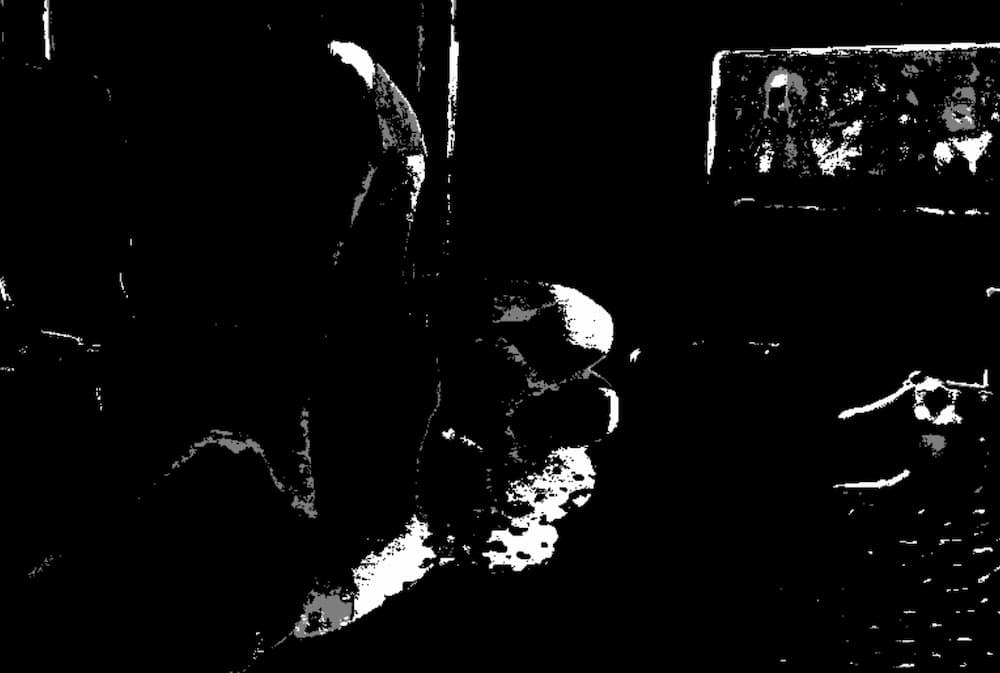

# Motion Detection and Cooldown Management System



Object detection and tracking systems are powerful tools that can provide valuable insights from video data. However, running these systems continuously can consume significant computational resources. 

This project introduces a motion detection system that triggers your object detection model only when potential objects of interest are present, optimizing resource usage and focusing processing power where it’s most needed.

## Table of Contents

1. [Features](#features)
2. [Files](#files)
3. [Installation](#installation)
4. [Usage](#usage)
    - [Main Script (`main.py`)](#main-script-mainpy)
    - [Main Cooldown Script (`main_cooldown.py`)](#main-cooldown-script-main_cooldownpy)
5. [Performance](#performance)
6. [Configuration](#configuration)
6. [Dependencies](#dependencies)
7. [License](#license)
8. [Contributing](#contributing)
9. [Contact](#contact)

## Features

- **Motion Detection:** Detects movement in video frames using background subtraction and motion thresholding.
- **Cooldown Management:** Keeps the object detection model active for a period after motion detection to handle objects that stop but remain in the frame.
- **Performance Monitoring:** Displays real-time performance metrics including FPS, motion detection latency, and resource usage.

## Files

- **`main.py`**: The main script for motion detection without cooldown management.
- **`main_cooldown.py`**: An extended version of the script with cooldown management to improve object detection stability.
- **`configs/config.py`**: Configuration file for adjustable parameters.
- **`utils/`**: Directory containing utility modules for video processing, motion detection, and performance monitoring.
- **`saved/cmon.py`**: Placeholder for any saved models or additional scripts.

## Installation

1. Clone the repository:

    ```bash
    git clone https://github.com/yourusername/your-repo.git
    cd your-repo
    ```

2. Create a virtual environment:

    ```bash
    python -m venv venv
    ```

3. Activate the virtual environment:

    - On Windows:

        ```bash
        venv\Scripts\activate
        ```

    - On macOS/Linux:

        ```bash
        source venv/bin/activate
        ```

4. Install dependencies:

    ```bash
    pip install -r requirements.txt
    ```

## Usage

### Main Script (`main.py`)

The `main.py` script captures video, processes frames for motion detection, and displays real-time feedback.

**Usage:**

1. Configure `configs/config.py` with your video stream URL and other parameters.
2. Run the script:

    ```bash
    python main.py
    ```

3. Press the 'q' key to exit the video stream.

### Main Cooldown Script (`main_cooldown.py`)

**Overview:**

The `main_cooldown.py` script extends the functionality of the motion detection system by introducing a cooldown period to manage object detection. This cooldown period ensures that the object detection model remains active after motion is initially detected, allowing it to capture and track objects that may have stopped moving but are still present in the frame. This approach improves the stability and accuracy of object detection by preventing the model from being deactivated immediately after motion stops, which can be useful in scenarios where objects may pause but still need to be detected.

**Benefits of Cooldown Management:**

- **Improved Stability:** Prevents the object detection model from toggling on and off with brief motion events, leading to more consistent tracking.
- **Enhanced Accuracy:** Ensures that objects that stop moving but remain in the frame are still detected and tracked.
- **Resource Efficiency:** Reduces the frequency of activating and deactivating the detection model, optimizing resource usage.

**Features:**

- **Cooldown Period:** Allows the object detection model to remain active for a specified duration after motion is detected.
- **Motion Detection and Tracking:** Continues to process frames and manage the activation state of object detection based on motion and the cooldown period.
- **Performance Metrics:** Displays real-time performance metrics including motion detection latency and FPS, aiding in the monitoring and optimization of the detection system.

**Usage:**

1. Configure `configs/config.py` with your video stream URL and other parameters.
2. Run the script:

    ```bash
    python main_cooldown.py
    ```

3. Press the 'q' key to exit the video stream.

## Performance

### Motion Detection Latency

The motion detection system has been tested to achieve the following average latency speeds:

- **0.002288 seconds**
- **0.001963 seconds**
- **0.002367 seconds**
- **0.001982 seconds**

These latency speeds reflect the time taken for the system to process each frame and detect motion. The low latency indicates that the system is capable of real-time motion detection with minimal delay, making it suitable for applications requiring timely responses to motion events.

## Configuration

- **`VIDEO_STREAM_URL`**: URL of the video stream.
- **`BACKGROUND_SUBTRACTOR_HISTORY`**: History parameter for background subtractor.
- **`BACKGROUND_SUBTRACTOR_VAR_THRESHOLD`**: Variance threshold for background subtractor.
- **`BACKGROUND_SUBTRACTOR_DETECT_SHADOWS`**: Flag to detect shadows.
- **`PROCESS_INTERVAL`**: Interval in frames for processing.
- **`FPS_DISPLAY_INTERVAL`**: Interval in seconds for displaying FPS.
- **`COOLDOWN_PERIOD`**: Cooldown period in seconds for keeping the object detection model active (only in `main_cooldown.py`).
- **`MOTION_THRESHOLD`**: Threshold for detecting motion in pixels.
- **`PRINT_INTERVAL`**: Interval in frames for printing performance info.

## Dependencies

- `opencv-python`
- `psutil`

You can install the required packages using:

```bash
pip install -r requirements.txt
```

## License

This project is licensed under the MIT License. See the [LICENSE](LICENSE) file for details.

## Contributing

If you'd like to contribute to this project, please fork the repository and submit a pull request with your changes.

## Contact

For any questions or feedback, please contact [Ray](mailto:ray@cybersavvy.one).
